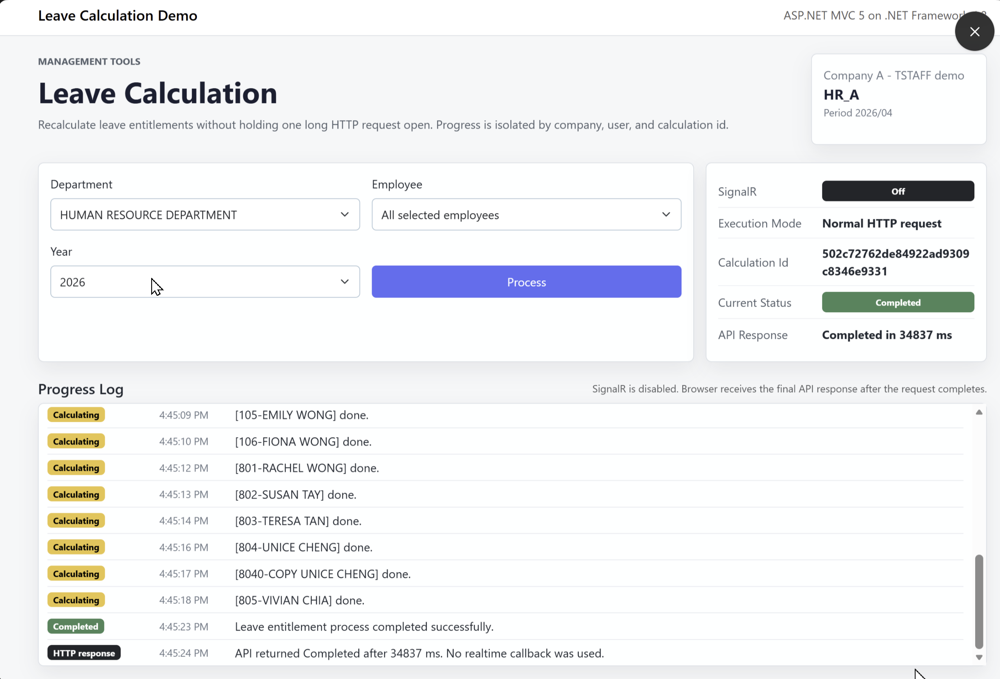
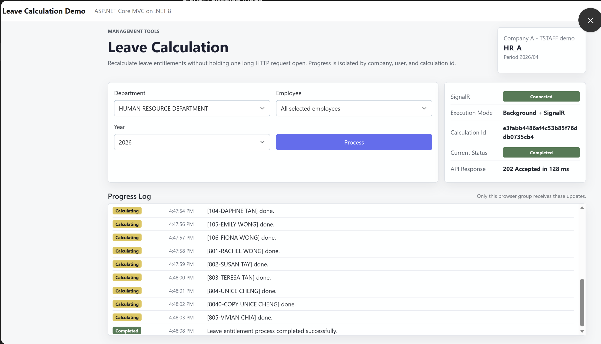
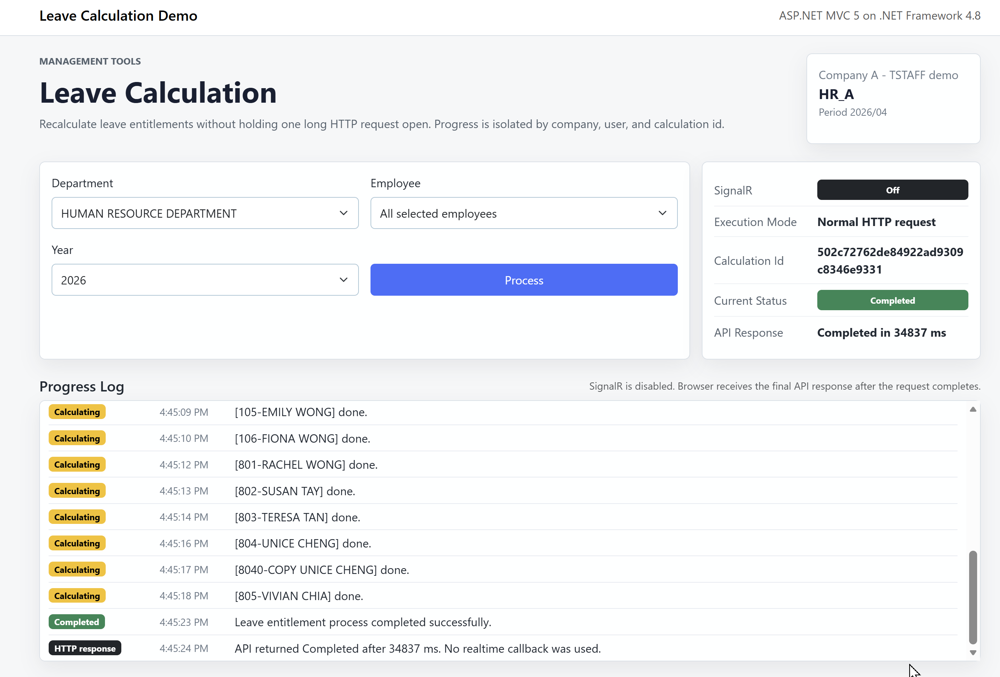
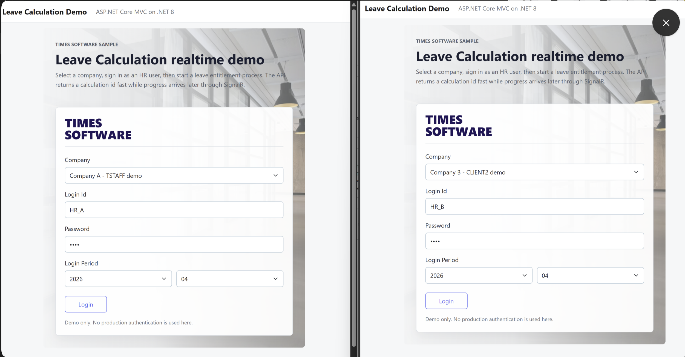
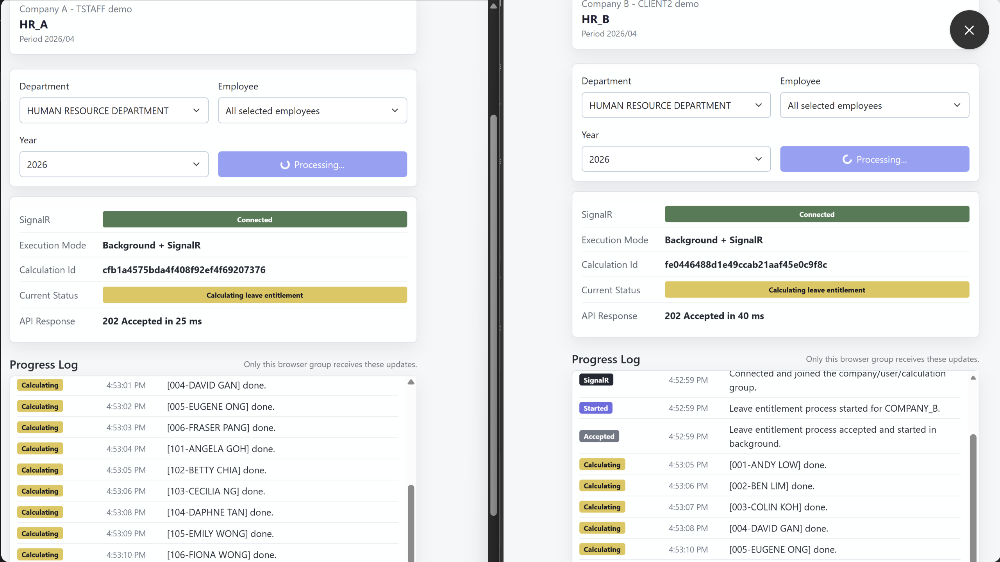
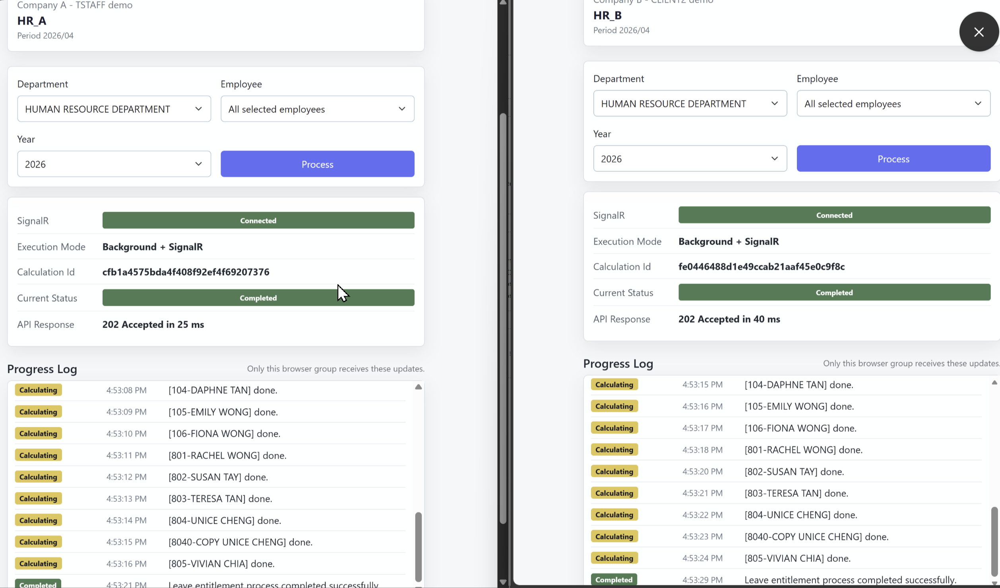

# Test Plan - SignalR Realtime Demo

## Purpose

Verify that Leave Calculation realtime updates are delivered to the correct Leave Calculation Page only.

Main target:

- No wrong company update.
- No wrong user update.
- No wrong calculation update.
- No overlap between multiple active pages.
- Returning to the Leave Calculation Page restores the correct running or completed calculation status.

## Test Environment

Run these projects together:

| Project | URL |
| --- | --- |
| `Timesoft.Solution.Web3` | `http://localhost:56540` |
| `Timesoft.Solution.Api.Web3` | `http://localhost:56541` |
| `Timesoft.Solution.RealtimeHub` | `https://localhost:5003` |

Optional parity test:

| Project | URL |
| --- | --- |
| `Timesoft.Solution.Web4` | `https://localhost:5101` |
| `Timesoft.Solution.Api.Web4` | `https://localhost:5102` |

For SignalR realtime tests, enable SignalR in both the Web project and the matching Api project.

For Web3:

```text
Timesoft.Solution.Web3\Web.config
LeaveCalculationDemo-SignalREnabled=true

Timesoft.Solution.Api.Web3\Web.config
SignalREnabled=true
```

For Web4:

```text
Timesoft.Solution.Web4\appsettings.json
LeaveCalculationDemo:SignalREnabled=true

Timesoft.Solution.Api.Web4\appsettings.json
SignalREnabled=true
```

Restore storage is configured only in the Web projects:

```text
Timesoft.Solution.Web3\Web.config
LeaveCalculationDemo-RestoreStorage=session

Timesoft.Solution.Web4\appsettings.json
LeaveCalculationDemo:RestoreStorage=session
```

## Test Data

Use different companies in different browsers:

| Browser | Company | Login User |
| --- | --- | --- |
| Chrome | `COMPANY_A` | `HR_A` |
| Firefox | `COMPANY_B` | `HR_B` |
| Edge | `COMPANY_C` | `HR_C` |

Use common process input:

| Field | Value |
| --- | --- |
| Department | `HR` |
| Employee | `ALL` |
| Year | `2026` |

## Test Case 1 - Single Page Realtime Flow

Steps:

1. Open Web3 Leave Calculation Page.
2. Login as `COMPANY_A / HR_A`.
3. Click `Process`.
4. Confirm Web3.Api returns a calculation id.
5. Confirm SignalR status is connected.
6. Confirm progress log updates until `Completed`.

Expected result:

- Leave Calculation Page receives realtime updates.
- Current status changes during the process.
- Progress log shows employee completion lines.
- Process button stops spinning after completion.

## Test Case 2 - Multi Company Isolation

Steps:

1. Open Chrome with `COMPANY_A / HR_A`.
2. Open Firefox with `COMPANY_B / HR_B`.
3. Open Edge with `COMPANY_C / HR_C`.
4. Click `Process` in all browsers close together.
5. Watch all progress logs.

Expected result:

- Each page has a different calculation id.
- Company A page receives only Company A updates.
- Company B page receives only Company B updates.
- Company C page receives only Company C updates.
- No progress line appears in the wrong page.

## Test Case 3 - Same Company, Different Calculation

Steps:

1. Open two browser windows.
2. Login both as `COMPANY_A / HR_A`.
3. Click `Process` in both pages.
4. Compare calculation ids.
5. Watch progress logs.

Expected result:

- Each page has a different calculation id.
- Each page receives only its own calculation updates.
- Updates do not cross between pages.

## Test Case 4 - SignalR Disabled Mode

Steps:

1. Set SignalR disabled in Web3 and Web3.Api configuration.
2. Restart Web3 and Web3.Api.
3. Open Leave Calculation Page.
4. Click `Process`.

Expected result:

- SignalR status shows disabled/off.
- Web3.Api runs the process inside the HTTP request.
- Leave Calculation Page waits for final response.
- Final status becomes `Completed`.
- No realtime push is used.

## Test Case 5 - RealtimeHub Not Running

Steps:

1. Start Web3 and Web3.Api.
2. Do not start `Timesoft.Solution.RealtimeHub`.
3. Open Leave Calculation Page.
4. Click `Process`.

Expected result:

- Web3.Api still accepts the process.
- Realtime notification cannot be delivered.
- Error should not crash Web3.Api.
- Status can still be checked from XML/history endpoint.

## Test Case 6 - Navigate Away While Process Is Running

Steps:

1. Enable SignalR in Web and Api.
2. Set restore storage to `session`.
3. Open the Leave Calculation Page.
4. Login as `COMPANY_A / HR_A`.
5. Click `Process`.
6. Confirm a calculation id appears.
7. Before the process completes, click `View Leave`.
8. Click `Back to Leave Calculation`.

Expected result:

- The same company and user context is shown.
- The same calculation id is shown.
- Latest status is loaded from the Api snapshot.
- Progress history is rebuilt from the snapshot history.
- If the process is still running, Process button remains disabled.
- The page reconnects to SignalR if possible and continues receiving progress.
- If SignalR cannot connect, snapshot polling continues updating the page.

## Test Case 7 - Return After Process Completed

Steps:

1. Enable SignalR in Web and Api.
2. Set restore storage to `session`.
3. Open the Leave Calculation Page.
4. Login as `COMPANY_A / HR_A`.
5. Click `Process`.
6. Click `View Leave` while the process is running.
7. Wait long enough for the process to complete.
8. Click `Back to Leave Calculation`.

Expected result:

- The same calculation id is shown.
- Current status shows `Completed`.
- Progress log shows the completed history from Api/XML storage.
- Process button is enabled for the next run.
- The page does not start a duplicate calculation.

## Test Case 8 - Restore Storage Modes

Steps:

1. Set restore storage to `session`.
2. Start a calculation, navigate to `View Leave`, then return in the same browser tab.
3. Confirm the active calculation restores.
4. Set restore storage to `local`.
5. Start a calculation, close and reopen the browser, then open the Leave Calculation Page again.
6. Confirm the active calculation restores.
7. Set restore storage to `off`.
8. Open the Leave Calculation Page again.

Expected result:

- `session` restores inside the same browser tab/session.
- `local` restores after closing and reopening the browser.
- `off` does not restore active calculation state.
- In every restore mode, the latest status comes from the Api snapshot, not directly from browser storage.

## Test Case 9 - SignalR Connect Fallback During Restore

Steps:

1. Enable SignalR in Web and Api.
2. Start RealtimeHub and start one Leave Calculation process.
3. Navigate to `View Leave` while the process is running.
4. Stop RealtimeHub or block the hub URL.
5. Return to the Leave Calculation Page.

Expected result:

- The page loads the latest calculation snapshot from Api.
- SignalR status changes to polling/fallback instead of treating the calculation as failed.
- Progress continues through snapshot polling while the Api process runs.
- When the calculation completes, final status shows `Completed`.

## Verification Checklist

For normal SignalR tests, confirm:

- `SignalR` shows connected.
- `Execution Mode` shows background + SignalR.
- Calculation id is visible.
- Group rule uses company, user, and calculation id.
- Only the matching Leave Calculation Page receives updates.
- Returning from `View Leave` reloads the same active calculation id.
- Running calculations resume tracking instead of starting a duplicate calculation.
- Completed calculations show final history and leave the Process button available.
- Final status becomes `Completed`.

For fallback tests, confirm:

- SignalR status shows polling/fallback.
- Snapshot reads still show the latest Api status.
- The calculation is not marked failed only because the hub is unavailable.

## Screenshot Evidence

| Screenshot | Purpose |
| --- | --- |
|  | Shows SignalR connected and one Leave Calculation Page receiving realtime progress. |
|  | Shows one full SignalR cycle completed successfully. |
|  | Shows normal HTTP completion when SignalR is disabled. |
|  | Shows Company A and Company B using separate login contexts. |
|  | Shows Company A and Company B running at the same time with separate calculation ids. |
|  | Shows both companies completed without crossing progress updates. |

## Pass Criteria

The SignalR implementation passes when:

- Multiple companies can process at the same time.
- Multiple pages can process at the same time.
- Each page receives only its own updates.
- No wrong calculation id appears in another page.
- No wrong company/user progress appears in another page.
- Navigation away and back restores the correct current status.
- Browser storage is used only as a pointer to reload the Api snapshot.

## Known Limitations

- XML storage is demo-only.
- Background work is in-process.
- RealtimeHub scale-out is not configured.
- Demo authentication is not production security.
- Browser reconnect behavior is basic for demo purposes.
- Restore remembers the last active calculation only for the configured browser storage scope.
