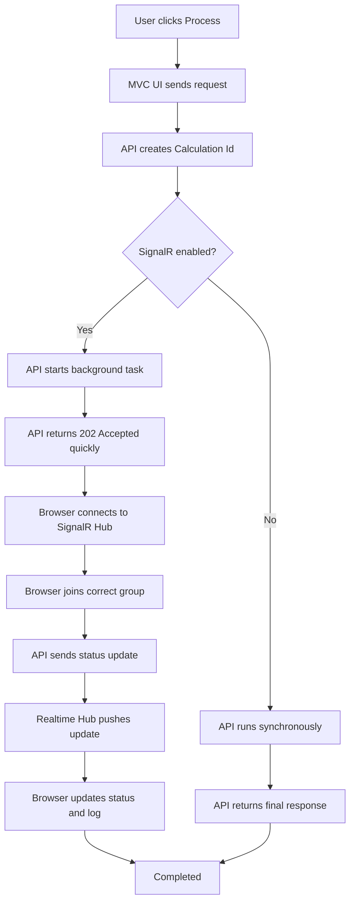

# One Cycle Flow - Realtime Leave Calculation

This document shows one simple end-to-end cycle for the demo.

Visual version:

- [OneCycleFlow_SimpleDiagram.svg](./OneCycleFlow_SimpleDiagram.svg)

## Goal

- User clicks `Process`
- API returns a `CalculationId`
- Realtime updates go only to the correct browser
- Browser shows `Started`, `Processing`, and `Completed`

## Simple Diagram



## One Cycle In Words

1. User opens the page.
2. User clicks `Process`.
3. MVC UI sends the request to the API.
4. API creates a new `CalculationId`.
5. If SignalR is enabled, API returns fast and continues in background.
6. Realtime Hub pushes progress to the matching browser only.
7. Browser updates the current status and progress log.
8. The cycle ends when the status becomes `Completed`.

## Correct Browser Rule

The update must stay inside the matching browser session.

Example group format:

```text
company:{companyCode}:user:{loginUserId}:calculation:{calculationId}
```

This keeps Company A, Company B, and Company C jobs separate even when they run at the same time.
